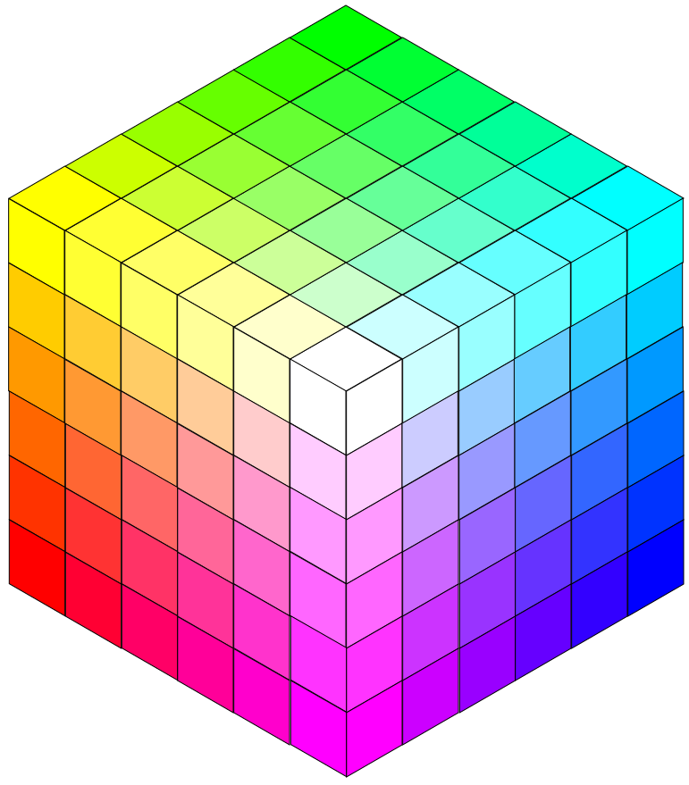
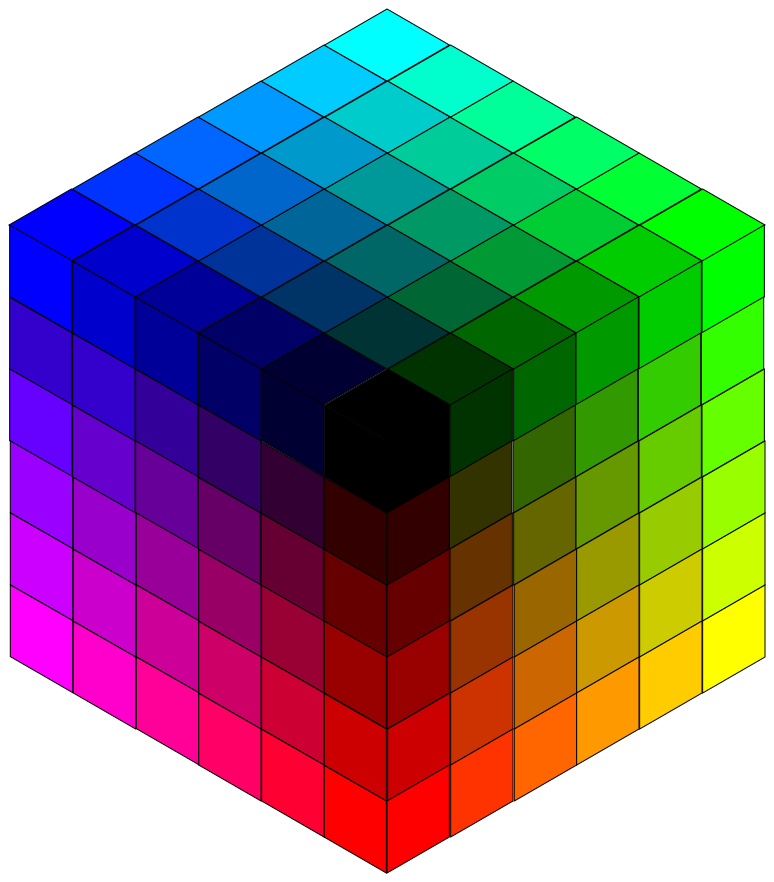

# What Are ANSI Escape Codes?
ANSI escape sequences were introduced in the 1970s as a standard for styling text terminals with color and font options. Supported by most modern operating systems, including Windows, macOS, and Linux, they allow you to add [colors](standard-16-colors.md) and [effects](effects.md) to your terminal output.

For example:

<pre><code>% I want <span class="fg-red">RED</span>, <span class="fg-green">GREEN</span>, <span class="fg-blue">BLUE</span> text...
% ... or <span class="bg-red">RED</span>, <span class="bg-green">GREEN</span>, <span class="bg-blue">BLUE</span> background...
% ... and I want <span class="effect-blinking">BLINKING</span> text.</code></pre>

## Building Blocks
### Escape Character
They always start with `\x1b`, `\033`, `\u001b`, or `\e` or depending on the operating system or programming language. Technically this inserts byte 27 into a string, which is equivalent to `0x1b` and the `ESC` key when you look at an [ASCII table](https://www.asciitable.com). Hence the name.

| Escape Character | Description |
| ---------------- | ----------- |
| `\x1b`           | Hexadecimal |
| `\033`           | Octal       |
| `\u001b`         | Unicode     |
| `\e`             | Escape in C |
| `27`             | Decimal     |

This first part is called the Control Sequence Introducer (CSI), whichever option you use. For convenience, we will use `\x1b` as the escape character throughout this section.

### Sequence Parts
All ANSI escape sequences follow the same pattern. For example, the sequence `\x1b[31m` can be broken down into:

| Part        | `\x1b[` | `31` | `m` |
| ----------- | :-----: | :--: | :-: |
| Description | Starts sequence, also called the Control Sequence Introducer (CSI). | Color code for various text and background colors, e.g. between `30`-`49` or `90`-`109`. | Ends sequence and calls the graphics function Select Graphic Rendition (SGR). |

## Examples
Though ANSI escape sequences appear in a string as multiple characters, they are in reality interpreted by the terminal as a single command. For example:

| Sequence   | Description             |
|------------|-------------------------|
| `\x1b[31m` | Change the color to red |
| `\x1b[0m`  | Reset any styling       |

Imagine that we want to achieve the following terminal output:

<pre><code>% I want <span class="fg-red">RED</span> color</code></pre>

We simply wrap the word `RED` with the ANSI escape sequences `\x1b[31m` to set the color and `\x1b[0m` to reset the color. The terminal will then interpret this as a single command while the characters of the escape sequences are hidden in the terminal output. The user only sees the changed color.

How to apply this in a print command:

```python
print("I want \x1b[31mRED\x1b[0m color")
```

!!! tip "Humanised Sequence Is Easier to Read"
    This is also why it's [convenient to use Colorist](../user-guide/standard-colors/text-foreground.md) instead of manually writing raw ANSI escape codes.

    The `Color` class will generate the ANSI escape sequences and keep the code readable. For example:

    ```python linenums="1" hl_lines="3"
    from colorist import Color

    print(f"I want {Color.RED}RED{Color.OFF} color")
    ```

    The result in the terminal output is the same as before:

    <pre><code>% I want <span class="fg-red">RED</span> color</code></pre>

## Color and Effects Options
You can use the same method to apply other colors and effects to text or backgrounds:

* [Standard 16 colors](standard-16-colors.md)
* [Extended 256 colors](extended-256-colors.md)
* [RGB colors](rgb-colors.md)
* [Effects](effects.md)

<div class="color-cubes">
    
    
</div>

## Support the Project
If you have already downloaded and tried the package – maybe even used it in a production environment – perhaps you would like to support its development?

!!! tip "Become a Sponsor"
    If you find this project helpful, please consider supporting its development. Your donations will help keep it alive and growing. Every contribution makes a difference, whether you buy a coffee or support with a monthly donation. Find your tier here:

    [Donate on GitHub Sponsors](https://github.com/sponsors/jakob-bagterp){ .md-button .md-button--primary }

    Thank you for your support! 🙌
