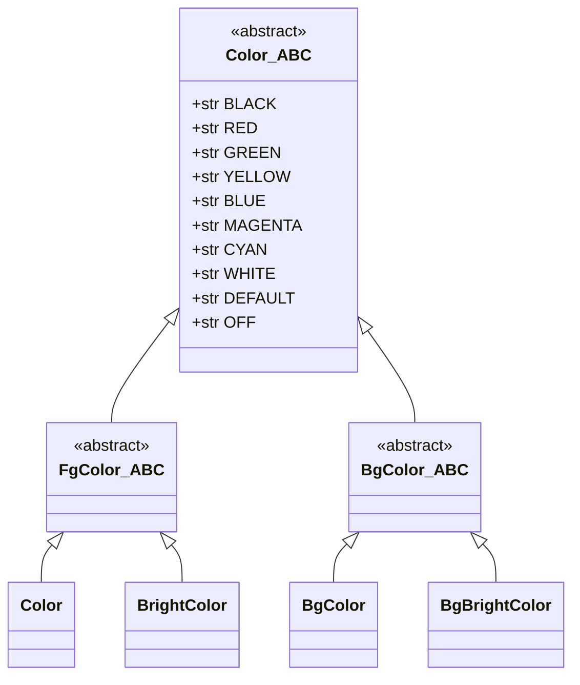
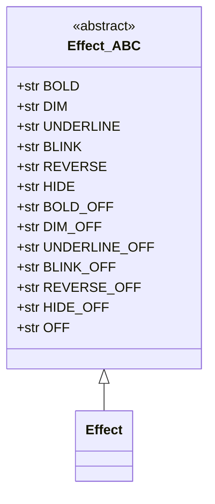
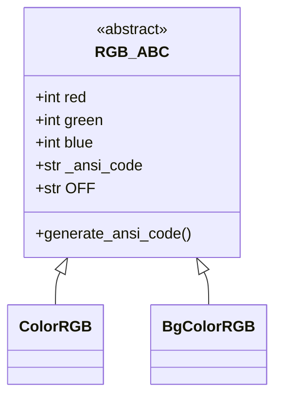
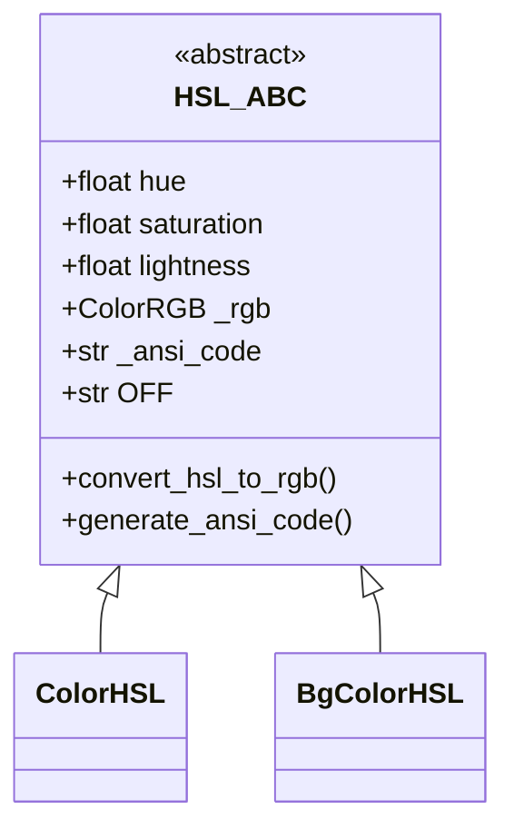
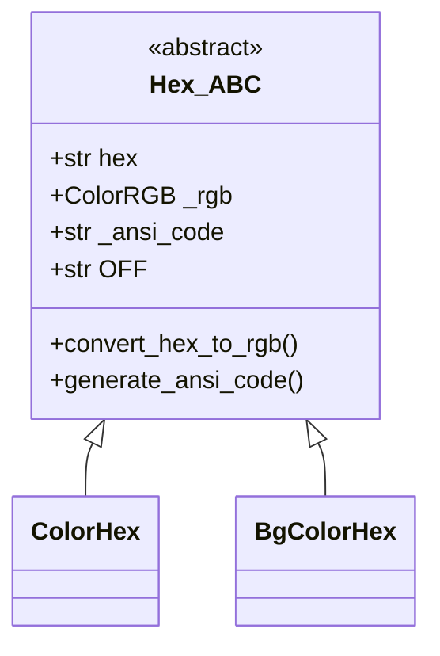

# About Colorist Model Structure
## Main Color Classes

```mermaid
classDiagram
class Color_ABC {
    <<abstract>>
    +str BLACK
    +str RED
    +str GREEN
    +str YELLOW
    +str BLUE
    +str MAGENTA
    +str CYAN
    +str WHITE
    +str DEFAULT
    +str OFF
}
class FgColor_ABC {
    <<abstract>>
}
class BgColor_ABC {
    <<abstract>>
}
class Color
class BrightColor
class BgColor
class BgBrightColor

Color_ABC <|-- FgColor_ABC
Color_ABC <|-- BgColor_ABC
FgColor_ABC <|-- Color
FgColor_ABC <|-- BrightColor
BgColor_ABC <|-- BgColor
BgColor_ABC <|-- BgBrightColor
```

## Effect Classes

```mermaid
classDiagram
class Effect_ABC {
    <<abstract>>
    +str BOLD
    +str DIM
    +str UNDERLINE
    +str BLINK
    +str REVERSE
    +str HIDE
    +str BOLD_OFF
    +str DIM_OFF
    +str UNDERLINE_OFF
    +str BLINK_OFF
    +str REVERSE_OFF
    +str HIDE_OFF
    +str OFF
}
class Effect

Effect_ABC <|-- Effect
```

## RGB Color Classes

```mermaid
classDiagram
class RGB_ABC {
    <<abstract>>
    +int red
    +int green
    +int blue
    +str _ansi_code
    +str OFF
    +generate_ansi_code()
}
class ColorRGB
class BgColorRGB

RGB_ABC <|-- ColorRGB
RGB_ABC <|-- BgColorRGB
```

## HSL Color Classes

```mermaid
classDiagram
class HSL_ABC {
    <<abstract>>
    +float hue
    +float saturation
    +float lightness
    +ColorRGB _rgb
    +str _ansi_code
    +str OFF
    +convert_hsl_to_rgb()
    +generate_ansi_code()
}
class ColorHSL
class BgColorHSL

HSL_ABC <|-- ColorHSL
HSL_ABC <|-- BgColorHSL
```

## Hex Color Classes

```mermaid
classDiagram
class Hex_ABC {
    <<abstract>>
    +str hex
    +ColorRGB _rgb
    +str _ansi_code
    +str OFF
    +convert_hex_to_rgb()
    +generate_ansi_code()
}
class ColorHex
class BgColorHex

Hex_ABC <|-- ColorHex
Hex_ABC <|-- BgColorHex
```
