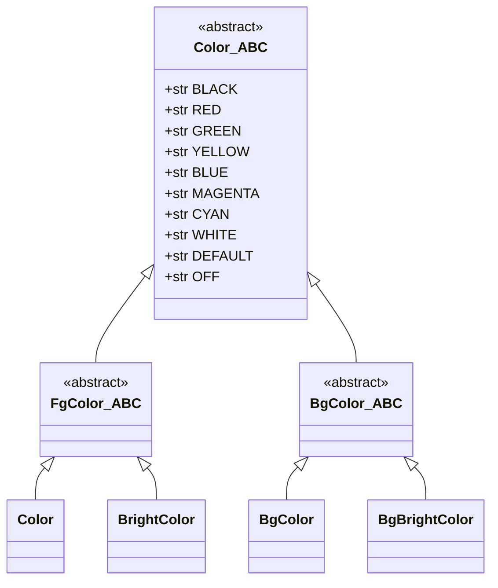

# About Colorist Model Structure
## Main Color Classes

```mermaid
classDiagram
class Color_ABC {
    <<abstract>>
    +str BLACK
    +str RED
    +str GREEN
    +str YELLOW
    +str BLUE
    +str MAGENTA
    +str CYAN
    +str WHITE
    +str DEFAULT
    +str OFF
}
class FgColor_ABC {
    <<abstract>>
}
class BgColor_ABC {
    <<abstract>>
}
class Color
class BrightColor
class BgColor
class BgBrightColor

Color_ABC <|-- FgColor_ABC
Color_ABC <|-- BgColor_ABC
FgColor_ABC <|-- Color
FgColor_ABC <|-- BrightColor
BgColor_ABC <|-- BgColor
BgColor_ABC <|-- BgBrightColor
```
